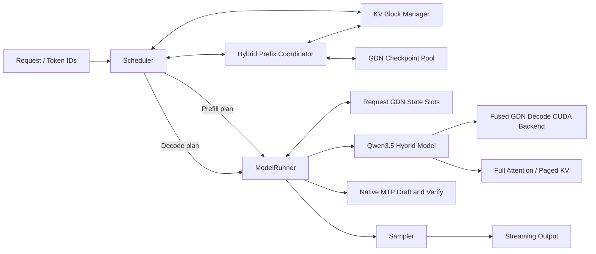

# Qwen3.5 Hybrid Inference Systems on nano-vLLM

An engineering fork of [GeeeekExplorer/nano-vllm](https://github.com/GeeeekExplorer/nano-vllm) focused on Qwen3.5 hybrid-model execution, recurrent-state lifecycle management, CUDA kernels, prefix reuse, speculative decoding, and serving experiments.

The repository keeps the upstream Git history and MIT license. The work documented below is the inference-system extension built on top of that baseline.

## Highlights

- **Qwen3.5 hybrid runtime**: layer-aware Gated DeltaNet (GDN) and Full Attention execution, request-owned recurrent/conv state slots, strict checkpoint loading, and Hugging Face golden validation.
- **Fused GDN decode backend**: a CUDA kernel that fuses causal Conv1D state update, SiLU, Q/K normalization, decay/beta, delta-state update, and per-head output.
- **Shape-aware Tensor Core GEMM**: FP32 CUDA Core tiling plus FP16/BF16 direct/staged WMMA, an equal-contract cuBLAS baseline, LLM-shape benchmarking, and measured cuBLAS fallback.
- **Fine-Grained Hybrid Prefix Cache**: decouples the 256-token physical KV page from a 16-token match unit, restores aligned GDN checkpoints, and uses partial-page KV copy-on-write (COW).
- **Native Qwen3.5 MTP**: draft, parallel verification, per-request accept/reject, and KV/GDN state commit or rollback.
- **Serving and scheduling**: continuous batching, chunked prefill, decode-first/SLO-aware scheduling, streaming, cancellation, request metrics, and OpenAI-compatible HTTP endpoints.
- **CUDA operator path**: custom AOT/JIT PyTorch extensions, CUDA Graph integration, Compute Sanitizer coverage, and reproducible micro/end-to-end benchmarks.

## Architecture



The model-level reusable boundary is the longest token prefix for which both resources are available:

```text
Full-Attention KV pages
        intersect
GDN recurrent + conv checkpoint
        equals
safe whole-model resume boundary
```

## Correctness Evidence

| Area | Validation |
| --- | --- |
| Official checkpoint | Qwen3.5-0.8B strict target/MTP loading with zero missing and unexpected parameters |
| Model output | Prefill/decode greedy tokens matched the Hugging Face reference on the recorded golden cases |
| Fused GDN kernel | FP16/BF16 differential tests, batch 1/2/4/8/16, CUDA Graph capture/replay |
| Recurrent stability | 32-step batch-8 drift: max core error `7.63e-6`, max FP32 state error `3.35e-8`, conv state exact |
| Memory safety | Compute Sanitizer memcheck: 0 errors; racecheck: 0 hazards |
| Prefix lifecycle | Prefix restore, partial-page COW, forced preempt-rehit, abort, and all-rank rollback tests |
| MTP | Full accept, immediate reject, variable per-request acceptance, state commit/rollback, and target-only token comparison |

The CUDA GDN backend remains opt-in. One stress prompt exposes a deterministic BF16 near-tie boundary: the Torch path produces exactly equal logits for tokens 16 and 17, while the fused reduction order changes one value by one BF16 ULP and selects token 17. Tensor/state errors remain bounded, but this repository does **not** claim universal bitwise or token identity for the optimized backend.

## Performance Methodology

Unless a table says otherwise:

```text
GPU:       NVIDIA RTX 3060 Laptop, 6 GiB, SM 8.6
Model:     official Qwen3.5-0.8B-Base
Dtype:     BF16 activations, FP32 recurrent state
Software:  PyTorch 2.8.0 + CUDA 12.8
```

Microbenchmarks use 20 warmup iterations, 100 measured iterations, and 7 repetitions. End-to-end backend comparisons alternate execution order across fresh engines:

```text
cycle 0: Torch -> CUDA
cycle 1: CUDA -> Torch
```

### Fused GDN Decode

| Batch | Torch core | CUDA core | Core speedup | Torch layer | CUDA layer | Layer speedup |
| ---: | ---: | ---: | ---: | ---: | ---: | ---: |
| 1 | 385.09 us | 27.37 us | 14.07x | 605.92 us | 246.96 us | 2.45x |
| 2 | 383.70 us | 40.85 us | 9.39x | 592.67 us | 244.91 us | 2.42x |
| 4 | 383.71 us | 63.17 us | 6.07x | 598.97 us | 248.22 us | 2.41x |
| 8 | 408.66 us | 108.87 us | 3.75x | 606.63 us | 250.25 us | 2.42x |
| 16 | 559.01 us | 200.87 us | 2.78x | 687.06 us | 307.97 us | 2.23x |

Selected end-to-end results:

| Execution | Concurrency | Output/request | Throughput | TPOT | Token result |
| --- | ---: | ---: | ---: | ---: | --- |
| Eager | 1 | 32 | +29.47% | -25.33% | exact |
| Eager | 3 | 32 | +25.77% | -25.98% | exact |
| CUDA Graph | 1 | 128 | +12.40% | -11.90% | exact |
| CUDA Graph (graph4, real batch3) | 3 | 128 | +15.06% | -15.70% | exact |
| Eager / CUDA Graph | 8 | 32 | positive | positive | one documented BF16 tie divergence |

Nsight Systems recorded 2,169 `cudaLaunchKernel` calls for the Torch microbenchmark and 421 for the fused path, an 80.6% reduction. Nsight Compute hardware counters were unavailable on the local host (`ERR_NVGPUCTRPERM`), so achieved bandwidth and occupancy are intentionally not reported.

See [docs/gdn-decode-kernel.md](docs/gdn-decode-kernel.md) for the complete kernel contract, profiling notes, lifecycle tests, and limitations.

### CUDA Operator Optimization: GEMM and RMSNorm

The standalone GEMM ladder under [`cuda_kernels/gemm`](cuda_kernels/gemm) covers FP32 naive/shared/register tiling and FP16/BF16 Tensor Core WMMA. It compares 22 dtype/shape combinations against a matching FP32-output cuBLAS contract.

Five fresh-process runs identified one stable custom-kernel regime:

| Shape | Direct WMMA vs cuBLAS | Decision |
| --- | ---: | --- |
| BF16 `M=16, K=1024, N=6144` QKV | 1.89x-2.02x | direct WMMA |
| BF16 `M=16, K=1024, N=7168` Gate-Up | 1.71x-1.74x | direct WMMA |
| FP16 QKV | 0.91x-1.11x | cuBLAS fallback |
| Larger-M / narrow-N shapes | custom path slower | cuBLAS fallback |

The staged WMMA path is preserved as a negative result. SASS confirms `HMMA.16816.F32` and `HMMA.16816.F32.BF16`; Compute Sanitizer reports zero memory errors and race hazards.

The RMSNorm path under `nanovllm/csrc` implements FP16/BF16 RMSNorm and Fused Add+RMSNorm with PyTorch Custom Op, AOT/JIT extension, current-stream, `torch.compile`, and CUDA Graph support. On the local BF16 H=1024/Rows=32 microbenchmark it reduced latency from 76.4 us to 10.7 us (about 7.1x), while the model-level A/B remained flat because GEMM/Attention dominated the end-to-end runtime.

See [`cuda_kernels/gemm/README.md`](cuda_kernels/gemm/README.md) and [docs/custom-rmsnorm.md](docs/custom-rmsnorm.md) for methodology, results, negative cases, and reproduction commands.

### Fine-Grained Hybrid Prefix Cache

For a 496-token shared prefix with 256-token physical pages and a 16-token match unit:

| Policy | Reused tokens | Producer forwards | No-share TTFT overhead |
| --- | ---: | ---: | ---: |
| Block-aligned | 256 | 2 | baseline policy |
| Fine dense | 496 | 32 | +61.14% |
| Fine adaptive | 496 | 2 | +1.97% |
| Fine internal checkpoint | 496 | 1 | +1.35% |

The partial-page COW copies 2,949,120 bytes across all Full Attention layers in approximately 0.08-0.10 ms on the local GPU. A forced lifecycle test performed two restores and two COW operations across preemption/re-admission and matched the cold Torch output.

Adaptive retention also promotes demand-discovered shared-prefix junctions. If
Full-Attention KV matches farther than the available GDN checkpoint, the second
sighting records the alignment loss and captures the missing recurrent state
while replaying the required suffix; the third and later requests can then
restore the joint boundary. Metrics expose KV-only misses, lost alignment
tokens, and planned/published/cancelled promotions.

The promotion admission threshold is expressed as total prefix sightings and
defaults to 2. A frequency-aware benchmark covers singleton, pair, triple,
hot, and Zipf traffic and reports useful-promotion ratio, replay, occupancy,
and churn. The local policy matrix supports second-sighting as the current
default while preserving pair-heavy traffic as its documented negative case.
See [docs/promotion-threshold-study.md](docs/promotion-threshold-study.md).

Cached recurrent checkpoints can independently use FP32, BF16, or symmetric
INT8 storage while active request state remains FP32. On the official 0.8B
layout, a fixed 128 MiB budget holds 6/13/24 checkpoints respectively. The
INT8 path uses per-head/per-key-channel FP32 scales, keeps conv history at its
native dtype, and dequantizes once on restore. See
[docs/checkpoint-compression.md](docs/checkpoint-compression.md) for the
1024-token correctness gate, transaction tests, latency, and limitations.

Reproduce the three-request promotion lifecycle with:

```bash
python benchmark_adaptive_prefix_promotion.py \
  --model /path/to/Qwen3.5-0.8B-Base \
  --shared-prefix-length 496 \
  --unique-suffix-length 64
```

See [docs/fine-grained-hybrid-prefix-cache-report.md](docs/fine-grained-hybrid-prefix-cache-report.md).

### Native MTP

The implementation is correctness-complete for the tested greedy path, including variable acceptance and recurrent-state transactions. On this 0.8B/local workload, MTP-2 remained approximately 15% slower than the fused target-only path at a 65.9% acceptance rate. This negative result is retained rather than presented as a speedup.

### Scheduler and Serving

The SLO-aware scheduler improved the measured token-SLO violation rate from 29.17% to 16.67% on the recorded Qwen3-0.6B Poisson workload, with a 0.53% throughput reduction. The burst workload remained a negative case. Workload definitions and evidence boundaries are in [docs/slo-scheduler.md](docs/slo-scheduler.md) and [docs/online-workload.md](docs/online-workload.md).

## Installation

```bash
git clone https://github.com/ifeidepig/inference-systems.git
cd inference-systems
python -m venv .venv
source .venv/bin/activate
pip install -e '.[serve,dev]'
```

`flash-attn` may require a CUDA/PyTorch-compatible build environment.

Build the optional CUDA extension explicitly:

```bash
CUDA_HOME=/path/to/cuda \
TORCH_CUDA_ARCH_LIST=8.6 \
python setup.py build_ext --inplace
```

Set `TORCH_CUDA_ARCH_LIST` for the target GPU when building on another platform.

## Quick Start

```python
from nanovllm import LLM, SamplingParams

llm = LLM(
    "/path/to/Qwen3.5-0.8B-Base",
    gdn_decode_backend="torch",  # torch | cuda | auto
)
outputs = llm.generate(
    ["Explain continuous batching."],
    SamplingParams(temperature=0.0, max_tokens=64),
)
print(outputs[0]["text"])
llm.exit()
```

The safe default is `gdn_decode_backend="torch"`. Use `cuda` only after building the extension and running the differential tests on the target GPU.

## Online Serving

```bash
nanovllm-serve \
  --model /path/to/Qwen3.5-0.8B-Base \
  --gdn-decode-backend cuda \
  --scheduling-policy decode_first \
  --max-num-batched-tokens 256
```

The server exposes `/health`, `/metrics`, `/metrics/requests`, `/v1/models`, `/v1/completions`, and `/v1/chat/completions`, including streaming responses and request cancellation.

Hybrid Prefix Cache example:

```bash
nanovllm-serve \
  --model /path/to/Qwen3.5-0.8B-Base \
  --enable-hybrid-prefix-cache \
  --prefix-match-unit 16 \
  --hybrid-prefix-checkpoint-interval-tokens 4096 \
  --hybrid-prefix-checkpoint-dtype int8 \
  --hybrid-prefix-promotion-min-sightings 2 \
  --hybrid-prefix-retention-policy adaptive \
  --hybrid-prefix-eviction-policy cost_aware \
  --enable-hybrid-internal-checkpoints \
  --max-num-seqs 1 \
  --hybrid-prefix-checkpoint-memory-mib 128
```

## Reproducing the Main Results

```bash
# Kernel differential, multi-step drift, and CUDA Graph tests
python -m unittest -v \
  tests.kernels.test_gdn_decode_dispatch \
  tests.kernels.test_gdn_decode_cuda

# Compute Sanitizer
compute-sanitizer --tool memcheck --error-exitcode 1 \
  python -m unittest -q tests.kernels.test_gdn_decode_cuda
compute-sanitizer --tool racecheck --error-exitcode 1 \
  python -m unittest -q tests.kernels.test_gdn_decode_cuda

# GDN microbenchmark
python benchmark_gdn_decode.py \
  --device cuda --dtype bfloat16 --backend cuda --batch-size 1

# Interleaved end-to-end A/B
python benchmark_gdn_backend.py \
  --model /path/to/Qwen3.5-0.8B-Base \
  --concurrency 1,3,8 \
  --max-num-seqs 8 \
  --output-tokens 32,128 \
  --execution both \
  --cycles 2

# Prefix Cache policy matrix
python benchmark_fine_grained_prefix_cache.py \
  --model /path/to/Qwen3.5-0.8B-Base \
  --shared-prefix-length 496 \
  --checkpoint-memory-mib 128 \
  --gdn-decode-backend cuda \
  --cuda-graph \
  --summary-only

# Forced prefix/COW/preempt-rehit lifecycle
python tests/validate_qwen35_gdn_cuda_lifecycle.py \
  --model /path/to/Qwen3.5-0.8B-Base

# Target-only versus native MTP
python benchmark_qwen35_mtp.py \
  --model /path/to/Qwen3.5-0.8B-Base \
  --mode both \
  --gdn-decode-backend cuda \
  --cuda-graph
```

## Repository Layout

```text
nanovllm/models/qwen3_5.py          Qwen3.5 hybrid model
nanovllm/layers/gated_delta_net.py GDN layer and backend dispatch
nanovllm/csrc/gdn_decode_kernel.cu Fused recurrent decode kernel
nanovllm/engine/state_manager.py   Request/checkpoint state pools
nanovllm/engine/hybrid_prefix_cache.py
                                    Hybrid prefix coordination
nanovllm/engine/scheduler.py       Scheduling, admission, preemption
nanovllm/engine/model_runner.py    CUDA Graph, MTP, COW, capture/restore
cuda_kernels/gemm/                 FP32/FP16/BF16 GEMM ladder and dispatch
tests/                             Unit, distributed, and GPU validation
```

## Known Limitations

- Qwen3.5 support is currently text-only; vision weights and inputs are not implemented.
- The CUDA GDN v0 kernel supports FP16/BF16 inputs, FP32 recurrent state, 128-dimensional key/value heads, equal local key/value head counts, and convolution width 4.
- Universal token identity is not guaranteed at exact BF16 logit ties; the safe default remains the Torch backend.
- Hybrid Prefix Cache and native MTP are currently mutually exclusive.
- Sparse internal prefix checkpoints currently require `max_num_seqs=1`.
- GDN prefill remains a correctness-first token scan; a chunkwise prefill backend is future work.
- Local validation uses the official 0.8B checkpoint. Qwen3.5-9B and real multi-GPU NCCL validation remain pending on an external compute platform.
- Nsight Compute bandwidth/occupancy metrics require a host with GPU performance-counter permission.
- The GEMM dispatch is a standalone backend prototype and is not wired into nano-vLLM Linear layers.

## Upstream and License

This repository is derived from [GeeeekExplorer/nano-vllm](https://github.com/GeeeekExplorer/nano-vllm). The original copyright notice and MIT license are preserved in [LICENSE](LICENSE).
